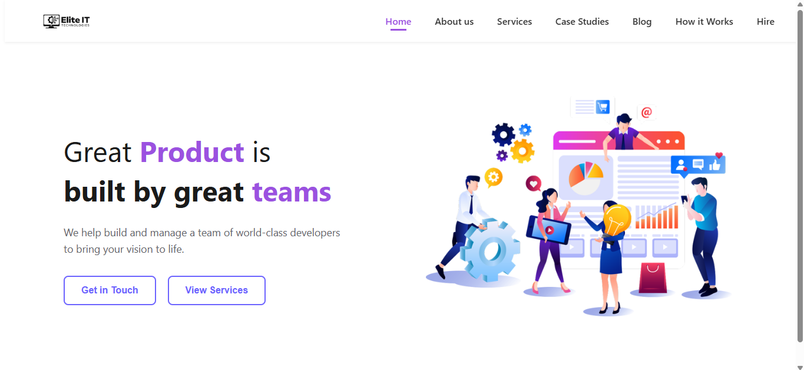
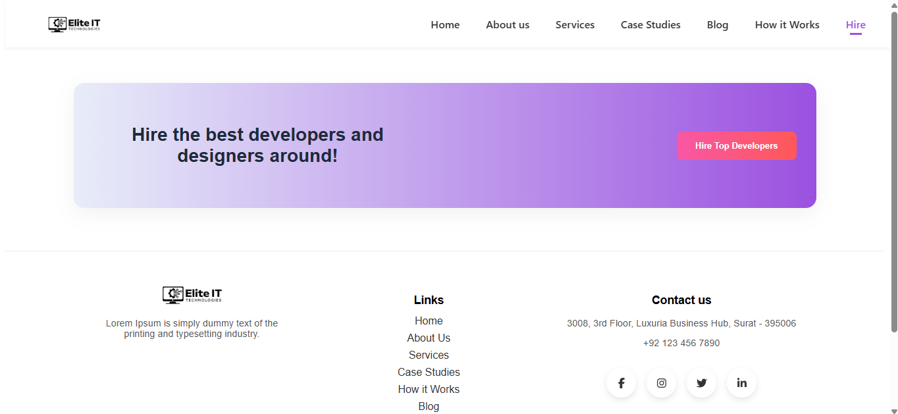
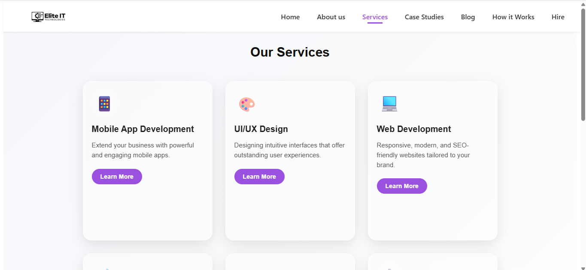
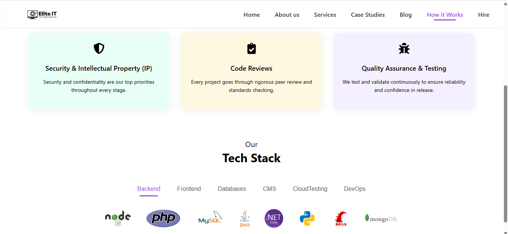

# 🌐 Elite IT - Company Website

A modern, multi-page, responsive website built for an IT services company using **React + Vite**. This project showcases services, blog articles, developer hiring, global presence, and company insights with a sleek user experience.

---

## 🚀 Tech Stack

- **Frontend**: React, React Router DOM
- **Build Tool**: Vite
- **Styling**: Tailwind CSS, CSS3
- **Icons**: Font Awesome, Lucide
- **Animation**: Framer Motion
- **Linting**: ESLint (extendable)
- **Deployment**: GitHub Pages, Vercel, or Netlify

---

## 📌 Features

- ⚡ Fast and lightweight performance with Vite
- 📱 Mobile-first, responsive design
- 🧑‍💻 Hire Developers form with file upload & domain selection
- 🧩 Reusable, clean components and structure
- 🌍 Global reach, vision, mission, and team sections
- ✍️ Blog and case studies layout
- ✨ Smooth UI with Framer Motion animations

---

## 📁 Project Structure

```
elite-it-website/
├── public/                 # Static HTML and assets
│   └── index.html
├── src/
│   ├── assets/             # Icons, images
│   ├── components/         # Reusable UI components
│   ├── pages/              # Route-based pages
│   ├── App.jsx             # Route configuration
│   └── main.jsx            # App entry point
├── .gitignore
├── LICENSE
├── README.md
├── index.html
├── package.json
├── vite.config.js
└── tailwind.config.js
```

---

## 🛠️ Getting Started

### 1. Clone the repository

```bash
git clone https://github.com/your-username/elite-it-website.git
cd elite-it-website
```

### 2. Install dependencies

```bash
npm install
```

### 3. Run the development server

```bash
npm run dev
```

### 4. Build for production

```bash
npm run build
```

### 5. Preview the production build

```bash
npm run preview
```

---

## 📦 Linting & Code Quality

This project includes basic ESLint configuration. You can extend it with:

- `eslint:recommended`
- `plugin:react/recommended`
- `plugin:jsx-a11y/recommended`

For TypeScript support, see [Vite React + TS Template](https://github.com/vitejs/vite/tree/main/packages/create-vite/template-react-ts).

---

## 🌍 Deployment

You can deploy the production-ready build to:

- **GitHub Pages**
- **Vercel**
- **Netlify**

Make sure to configure `vite.config.js` properly for GitHub Pages (e.g., `base` path if in a subdirectory).

---

## 📸 Screenshots







---

## 👨‍💻 Author

**Nikunj Hadiya**  
web Developer | IT Consultant  
[LinkedIn](https://www.linkedin.com/in/nikunjhadiya/) • [Portfolio](Currently not available) • [Email](mailto:ahirnikunj1122@gmail.com) | (mailto:nikasus66@gmail.com)

---

## 📄 License

This project is licensed under the [MIT License](LICENSE).
